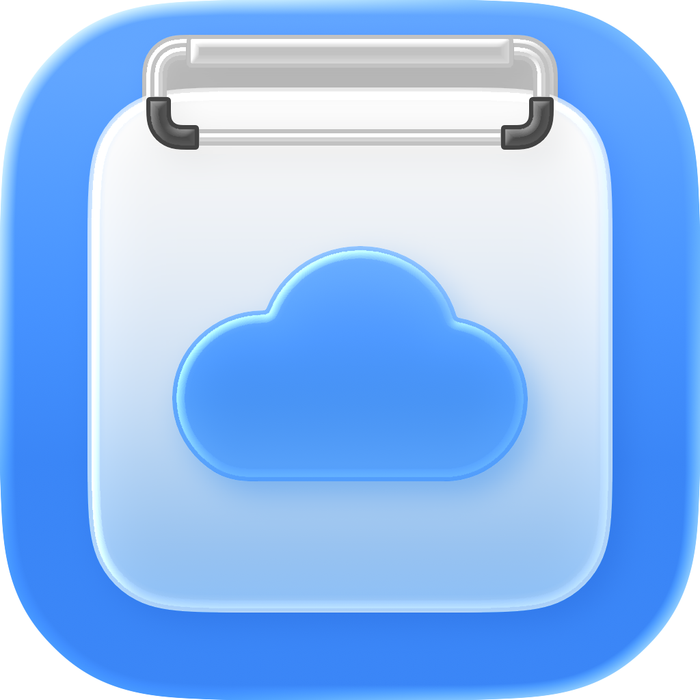

# Awesome Copy

The clipboard manager built for macOS power users.

  

## Download

Download the latest DMG from the Releases section.

# Awesome Copy Releases

Official release repository for Awesome Copy.

## Download

Visit the latest release to download the current macOS version of Awesome Copy:

https://github.com/kindparkllc/awesome-copy-releases/releases/latest

## About Awesome Copy

Awesome Copy is a powerful macOS clipboard manager designed for fast workflows, rich previews, search, organization, and seamless clipboard history management.

Learn more at:

https://awesomecopy.app

## Support

For help, feedback, or feature requests:

https://awesomecopy.app

## License

All release binaries are proprietary software and are not open source unless explicitly stated otherwise.
